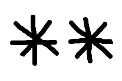

# Grid Parser
Forensics - 45 points

## Challenge 

Written by Alaska47

I found this [grid](ecdb2ff56241299271bf44268880e46a304f50d212ae05dab586e3843ad59d50_movies.grid) while doing some parsing. Something about it just doesn't seem right though...

## Solution

#### Part 1 - Extract hidden file

	$ file *.grid
	ecdb2ff56241299271bf44268880e46a304f50d212ae05dab586e3843ad59d50_movies.grid: Microsoft OOXML

It is a Microsoft Office file. Rename it to a zip and open its contents.

Inside it, we find a file `./xl/media/password.png`

	$ strings ./xl/media/password.png | tail
	2018-08-03T15:04:02+00:00
	%tEXtdate:modify
	2018-08-03T15:04:02+00:00
	tEXtSoftware
	gnome-screenshot
	IEND
	flag.txtUT
	nd[ux
	flag.txtUT
	nd[ux

There is a hidden `flag.txt`. Use foremost to extract it.

	$ foremost password.png 
	Processing: password.png
	|foundat=flag.txtUT	
	*|

We get a zip that is password protected.

#### Part 2 - Crack ZIP file

I will reuse my script from [PACTF 2018 Let Me In](https://github.com/zst123/pactf-2018-writeups/tree/master/Lovelace/Let_Me_In).

Looking at the PNG, it implies that the password is 2 chars long

I quickly generated a list of password combinations.

	>>> charset = '0123456789abcdefghijklmnopqrstuvwxyzABCDEFGHIJKLMNOPQRSTUVWXYZ!"#$%&\'()*+,-./:;<=>?@[\\]^_`{|}~'
	>>> for a in charset:
	...   for b in charset:
	...     with open('password-list.txt', 'a') as f:
	...       f.write(a+b+'\n')

And then I ran my solver

	$ bash solve.sh
	Doing 8778 
	Password is: 0X

Unfortuately, there are false positives which yields unreadable files.

I made some changes to check the contents of the extracted `flag.txt` to see if it contains `tjctf{`

And we find the flag

	$ bash solve.sh 
	mkdir: output: File exists
	Doing 6479 
	Password is: px
	tjctf{n0t_5u5_4t_4LL_r1gHt?}

## Flag

	tjctf{n0t_5u5_4t_4LL_r1gHt?}
