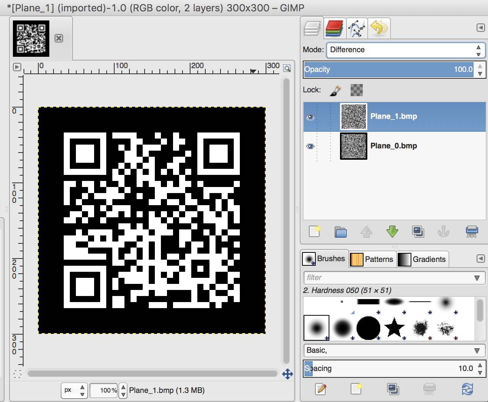
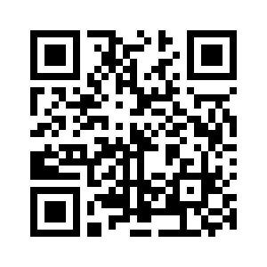

# Interference
Miscellaneous - 15 points

## Challenge 

Written by jfrucht25

I was looking at some images but I couldn't see them clearly. I think there's some [interference](01a68dd1c1db3bb4eb69853b32cb4dbbc22c6c05abf994733e99b928c20c5295_interference.zip).

## Solution

- v1.png is the original.
- v2.png is larger and appears to have some extra data inside

Open the larger image (v2.png) in StegSolve.

Upon looking through the planes, the RGB Plane 0 has a different pattern from the rest!

I saved Plane 0 and Plane 1 into bmp files.

Open them in GIMP and set one layer to Difference.

We see a QR code, invert its colors and scan it for the flag

## Flag

	tjctf{m1x1ing_and_m4tchIng_1m4g3s_15_fun}