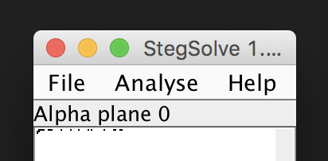

# Lexington State Bank
Forensics - 40 points

## Challenge 

Written by jfrucht25

I thought the bank only dealt with money, but, apparently, LSB also hides information in images.

[Source](664afe59e115a10214ee14b11dd4c39bb07a361cdb5df1791a4553d4eb9bcca8_LexingtonStateBank.png)

## Solution
Open the image in StegSolve and we see there are some hidden bits in the LSB plane of all channels (R, G, B, A)

With this, I decided to read the color info and extract out the last bit of each channel

	$ python3 solve.py 
	tjctf{1t_w4s_as_easy_as_LSB}33333333333333333333333333333333333333333333333*3333333333333333333333333333333333333333333333333333333333333333333333333333333333333333333333333333333333333533333333333333333333333333333333333333s33]ÝÝW333333ÝñµÓ?3=ÝÝÝݝS3333UQ•ñµ3333333333ûU¹]33333333333333Q±SÓ333333ћÝÝ_S3333›ûu¿³•ß“ýß½S™•3331ßó¹}}×õ333333333?Y1qÝ333333333333=5Ó333333Õ¹Ýݵ333;›¿7ÙÙ·W½Ów9;ñ³33ߛS_1•ýµ3333333339—1ýuÓ333333333333ùõ3333333=ÿùwÓ3331uÛ]×7ŸóY¿ûyÕ?ó]3;›½·¿ù3sýó3333333333ÙU—»Ý±Ó3333333333333;33333333ñÿ÷S3333Ÿß3=õßÿûŸÿûÓ5?]3[?»wýs3333333333ß×y÷ŸùS333333333333=ÿ33333333;ÿóÓ3333ß?ÑÓ3W}SџùÙ·Õÿ—sÕwS=±›[Ss3333333333»ùµõñ3333333333333µ•“33333333;ÿõ³3333»ñU3;wsџÿÙYÿõ739³¹;y“Q]333»333Ÿ›Ÿÿõõó33W·Õ=}Y3Û[›½Ó33333;

## Flag

	tjctf{1t_w4s_as_easy_as_LSB}