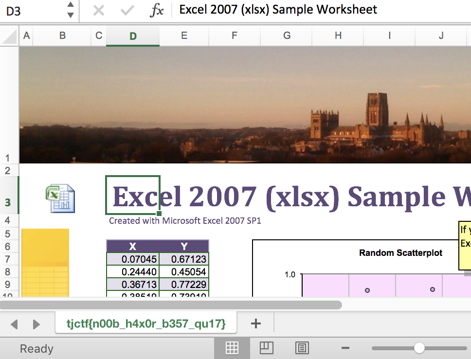

# Nothing but Everything
Miscellaneous - 20 points

## Challenge 

Written by evanyeyeye

My computer got infected with ransomware and now none of my [documents](7459b0c272ba30c9fea94391c7d7051d78e1732c871c3a6f27070fcb34f9e734_encrypted.tar.gz) are accessible anymore! If you help me out, I'll reward you a flag!

## Solution

On first look, it seems like all the words are hex-encoded. Trying to hex-decode will yield no results though.

But notice that the filenames have no letters from `A-F`.

It appears that it is the decimal of the hex-encoded text

	$ python
	>>> hex(1262404985085867488371)
	'0x446f63756d656e7473L'
	>>> "446f63756d656e7473".decode('hex')
	'Documents'

Solving using a script, I decrypted each file recursively

	$ python3 decrypt.py 
	Decrypted: ./1262404985085867488371/8274822079022869869204687450215
	Generated: ./1262404985085867488371/hqdefault.jpg

	Decrypted: ./1262404985085867488371/34789779679479754657679568487
	Generated: ./1262404985085867488371/pingpong.png

	Decrypted: ./1262404985085867488371/26341884401526473782857414640542328449392
	Generated: ./1262404985085867488371/Minecrafter_3.zip

	Decrypted: ./1262404985085867488371/1466921579/8271125182571090032378480718712
	Generated: ./1262404985085867488371/1466921579/here (2).xlsx

	Decrypted: ./1262404985085867488371/1466921579/1925771400061232378744
	Generated: ./1262404985085867488371/1466921579/here.xlsx

	Decrypted: ./1262404985085867488371/1466921579/35968812289330274501209969225454293093549792102172191857182011235
	Generated: ./1262404985085867488371/1466921579/Word Document Checklist.doc

	Decrypted: ./1262404985085867488371/1466921579/2128972134415790796643
	Generated: ./1262404985085867488371/1466921579/silly.doc

	Decrypted: ./1262404985085867488371/1466921579/8267118843167606069269960130490028057254483967722922083093910610582729969135459
	Generated: ./1262404985085867488371/1466921579/Georgia_opposition_NATO-Eng-F.doc

	Decrypted: ./1262404985085867488371/74145705061991/545218985413062857025894
	Generated: ./1262404985085867488371/74145705061991/stack1.gif

	Decrypted: ./1262404985085867488371/74145705061991/97499153913550360156901569121038575014308380127963939868083267002955188984637801129062
	Generated: ./1262404985085867488371/74145705061991/2017-09-29_Advanced_Graph_Theory.pdf

	Decrypted: ./1262404985085867488371/74145705061991/161996175101209818055707184771753593424259197701634195705567049434429306104545448846438
	Generated: ./1262404985085867488371/74145705061991/Scratch_programming-concepts-1.3.pdf

	Decrypted: ./1262404985085867488371/74145705061991/8100972374518689383
	Generated: ./1262404985085867488371/74145705061991/plot.png

Unfortunately my script doesn't account for the directory names, so I did it manually
	
	$ python3
	>>> import decrypt
	
	>>> decrypt.decrypt_int("74145705061991")
	b'Coding'
	
	>>> decrypt.decrypt_int("1466921579")
	b'Work'
	
	>>> decrypt.decrypt_int("1262404985085867488371")
	b'Documents'

Upon opening `here (2).xlsx`, we find the flag in the sheet name

## Flag

	tjctf{n00b_h4x0r_b357_qu17}
