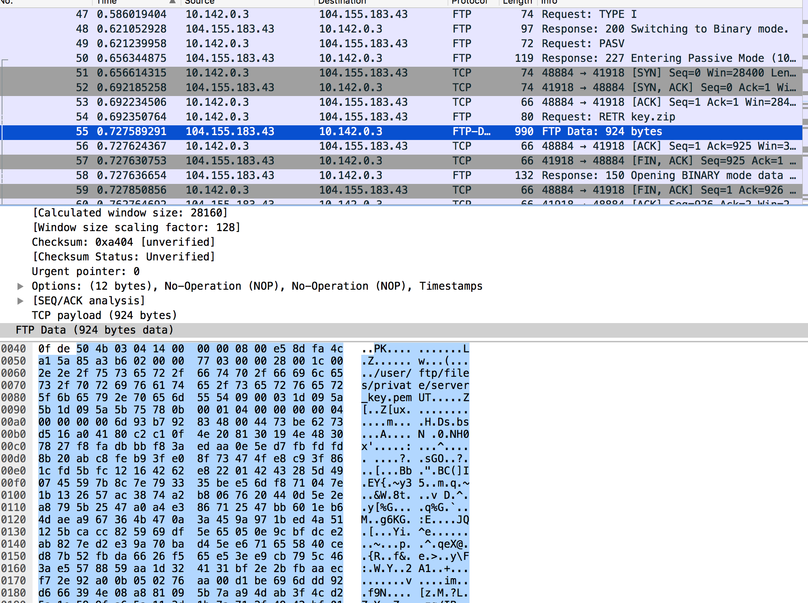
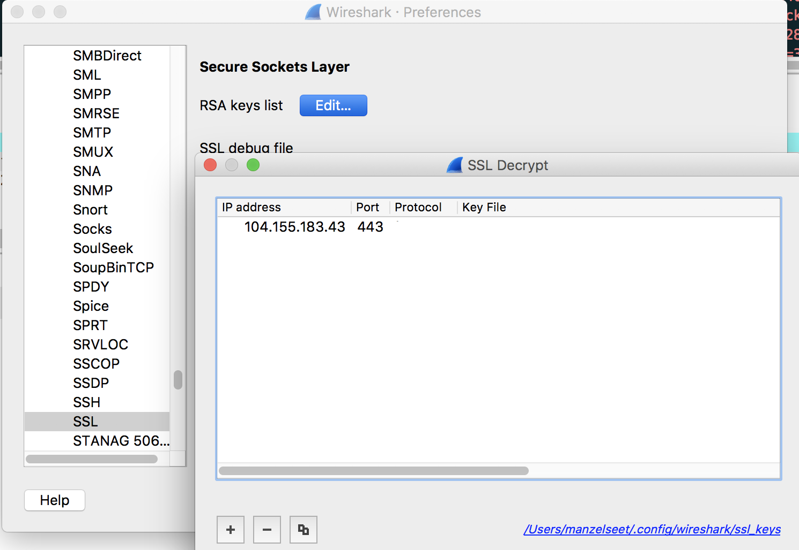
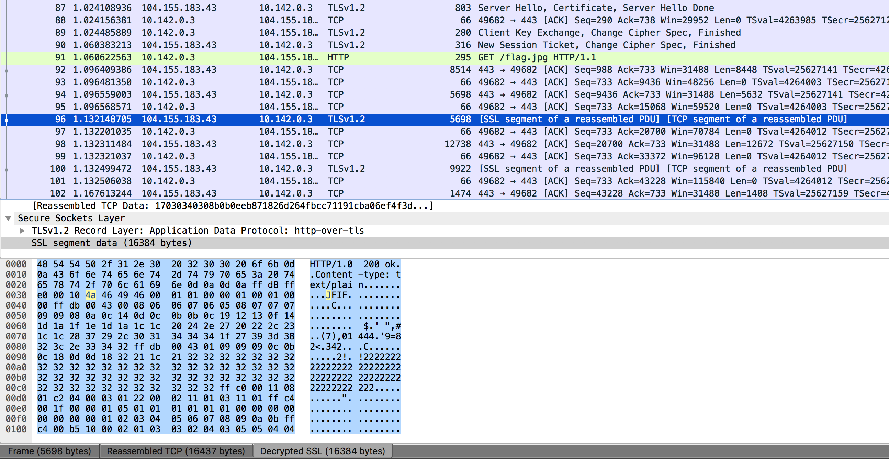
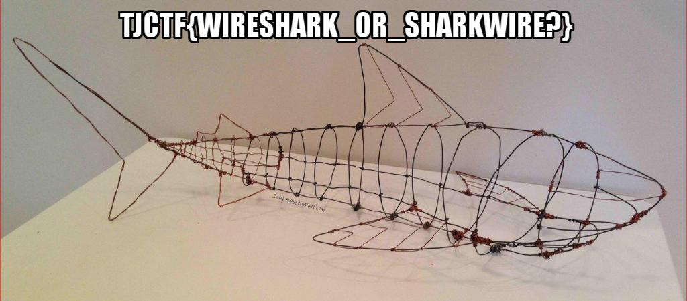

# Ssleepy
Forensics - 70 points

## Challenge 

Written by Alaska47

I found this super suspicious [transmission](99870da89e552d13905dbff3fe0543ca336c4c425cb723e3f4b6c0e91a6e23e7_ssleepy.pcapng) lying around on the floor. What could be in it?

## Solution

#### FTP instance
The first instance we see is an FTP connection. In this, the user downloads a file `key.zip`

Locate the FTP Data and we can extract it 
- Right Click > Follow > TCP Stream
- Show and save data as: Raw
- Save as: key.zip

Now inside it, we find a Private Key PEM.

---

#### Decrypt SSL connections

After looking at wireshark a little more, there is another instance of HTTPS connections (port 443) below.

Maybe we can use the private key to decrypt the packets.

Reference:
- https://support.citrix.com/article/CTX116557
- https://wiki.wireshark.org/SSL

Steps:
- Preferences > Protocols > SSL
- RSA key list > Edit
	- IP Address: 104.155.183.43
	- Port: 443
	- Protocol: (empty)
	- Key File: server_key.pem
	- Password: (empty)

---

#### Extract flag

Now, we can see the traffic. There is a flag.jpg being downloaded.

Once again, extract the raw data by right clicking > SSL Stream.

I saved it as `output_flag.txt`. Now, we need to strip the HTTP headers using a hex editor. Make sure the start of the file is the JPEG header.

## Flag

	tjctf{wireshark_or_sharkwire?}